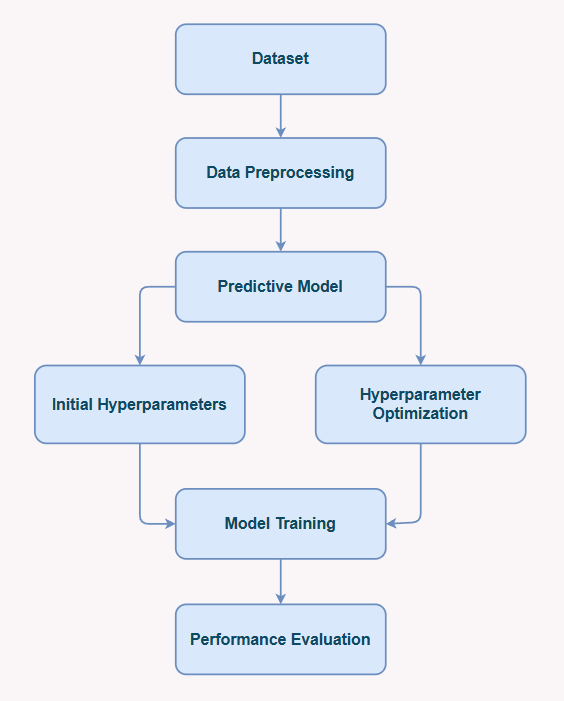
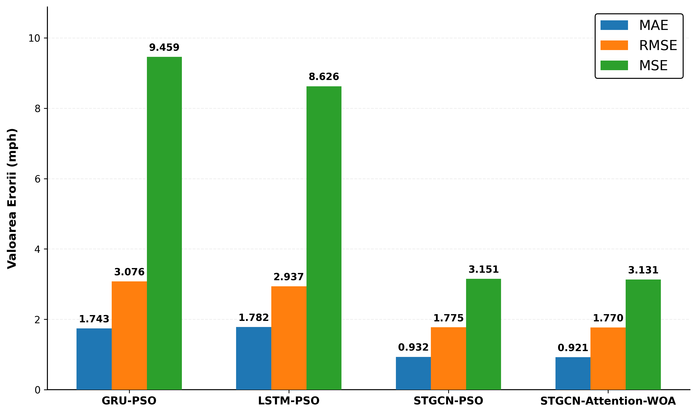
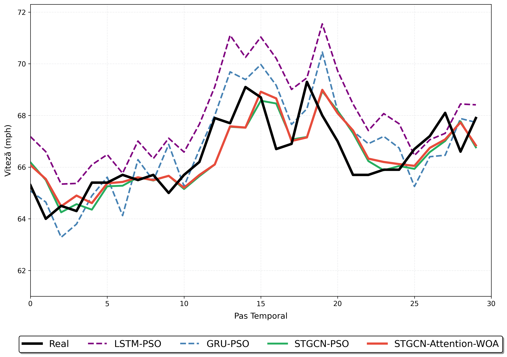
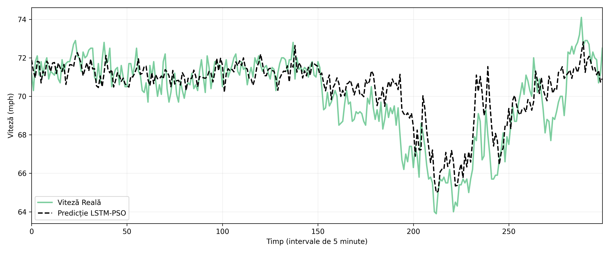
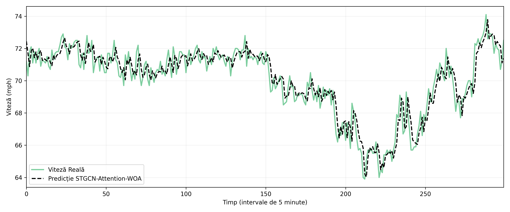

# Urban Traffic Prediction Using Artificial Intelligence Techniques

This repository contains the code developed for my Bachelor's thesis in Systems Engineering at Gheorghe Asachi Technical University of Iași.

The project investigates the use of deep learning models for urban traffic speed prediction by comparing recurrent neural networks and spatial-temporal graph neural networks. In addition, the impact of two metaheuristic optimization algorithms, Particle Swarm Optimization (PSO) and Whale Optimization Algorithm (WOA), is evaluated for hyperparameter tuning.

Each notebook represents a complete experiment, allowing different model configurations to be trained, evaluated, and compared under the same experimental setup.

---

## Project Overview

The experimental workflow consists of the following stages:

- Data preprocessing
- Model implementation
- Hyperparameter configuration
- Model training
- Hyperparameter optimization (PSO / WOA)
- Performance evaluation
- Result analysis

The following architectures were implemented and evaluated:

| Model | Standard | PSO | WOA |
|:------:|:--------:|:---:|:---:|
| LSTM | ✅ | ✅ | ✅ |
| GRU | ✅ | ✅ | ✅ |
| STGCN | ✅ | ✅ | ✅ |
| STGCN-Attention | ✅ | ✅ | ✅ |

---

## Experimental Workflow

The following diagram summarizes the methodology used throughout the project.

<p align="center">
  
</p>

---

## Repository Structure

```text
.
├── LSTM.ipynb
├── LSTM-PSO.ipynb
├── LSTM-WOA.ipynb
│
├── GRU.ipynb
├── GRU-PSO.ipynb
├── GRU-WOA.ipynb
│
├── STGCN.ipynb
├── STGCN-PSO.ipynb
├── STGCN-WOA.ipynb
│
├── STGCN-Attention.ipynb
├── STGCN-Attention-PSO.ipynb
├── STGCN-Attention-WOA.ipynb
│
├── matrice_adiacenta.ipynb
│
├── images
│   ├── workflow.png
│   ├── model_comparison.png
│   ├── prediction_comparison.png
│   ├── lstm_prediction.png
│   ├── stgcn_prediction.png
│   └── stgcn_attention_prediction.png
│
├── README.md
├── requirements.txt
└── LICENSE
```

Each notebook contains the complete implementation of one experimental configuration, including data preprocessing, model definition, training, evaluation, and visualization.

---

## Technologies

- Python
- PyTorch
- PyTorch Geometric
- NumPy
- Pandas
- Matplotlib
- CUDA

---

## Results

The experiments show that spatial-temporal graph neural networks consistently outperform the recurrent architectures evaluated in this study.

Among all tested configurations, **STGCN-Attention-WOA** achieved the best overall performance, obtaining the lowest prediction errors while closely following the real traffic speed across different traffic conditions.

Hyperparameter optimization significantly improved the recurrent models, whereas its impact on the graph-based architectures was more moderate, indicating that the STGCN models were already relatively robust to the selected hyperparameters.

### Model Comparison

<p align="center">
  
</p>

The figure compares the best-performing configurations using the evaluation metrics obtained during testing.

### Prediction Comparison

<p align="center">
  
</p>

Comparison between the predicted and actual traffic speed for the best-performing models.

### Example – LSTM-PSO

<p align="center">
  
</p>

### Example – STGCN-Attention-WOA

<p align="center">
  
</p>

---

## Future Improvements

Possible extensions of this project include:

- replacing the fixed adjacency matrix with dynamic graph representations that adapt to changing traffic conditions;
- integrating additional information such as weather conditions, road incidents, infrastructure works, or public events;
- extending the models to perform multi-step traffic prediction;
- investigating alternative hyperparameter optimization techniques with lower computational cost;
- evaluating the proposed models on additional traffic datasets collected from different cities;
- exploring more recent graph neural network architectures, including Transformer-based spatial-temporal models.

---

## About

This repository contains the implementation developed for my Bachelor's thesis in Systems Engineering at **Gheorghe Asachi Technical University of Iași**.

The project provided practical experience in deep learning, graph neural networks, hyperparameter optimization, and machine learning workflows for time-series forecasting.
